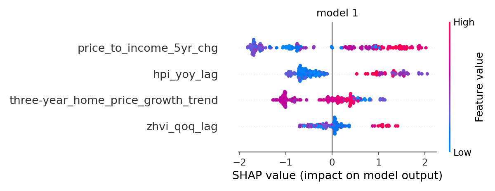

## The one-liner

> We integrated **Zillow home value, FHFA house-price data, census income data, and census poulation data** into **metro-level housing-risk dataset** so that
> **pubilc officials** can **make decisions about housing affordability and risk**.

* **Role:** I led data cleaning, feature engineering, model training, creation of visualizations, and writing documentation.
* **Team:** Solo
* **Repo:** [https://github.com/BSmith-cpu/DATA-510-CAPSTONE-](https://github.com/BSmith-cpu/DATA-510-CAPSTONE-)

## The question

Housing affordability can worsen quickly when home prices rise faster than 
local income. I examined which housing-market and economic indicators are 
most associate with unaffordable condition in the U.S. metro areas, and
whether they can help flag metros for further investigation. 

## The data

I combined Zillow Home Value Index data, FHFA House Price Index data, Census
Median household income, and Census population estimate. The final dataset
contains 83,699 rows and 25 columns of quarerly metro-area observation from 2010-2024.

The main data-engineering challenge was joining sources reported at different time invervals.
Most of the data was split into either monthly, quarterly, and annual. When that was normalized
I joined them all through CBSA metro codes, while fix Tampa CBSA mismatch between Census and Zillow data
before modeling. 

## The approach

I combined and cleaned the data, creating housing market features, and trained two XGBoost models. The
first model was to anwser the primary research question of which features are most important when prediciting
affordability stress for U.S. metros. The second was a generalized model, that would give each city a "risk-score"
showing that these cities are following the same trend as the training cities for the models. 

## Findings

{fig-alt="Model 1 SHAP Importance" width="90%"}

The five-year change in the price-to-income ratio was the strongest sign of current housing unaffordabilty.
House price growth also mattered. The model was trained on only Austin, Boise, and Tampa, so it should be used to 
identify cities for further review. 

## The full write-up

[Download the write-up (PDF)](/Users/brandonsmith/bsmith-cpu.github.io/projects/capstone/writeup.pdf){.btn .btn-primary}

<iframe src="projects/capstone/writeup.pdf" width="100%" height="800px"
  style="border: 1px solid #ddd;"></iframe>

## Dig deeper

- 📦 **Code & pipeline:** [capstone-repo](https://github.com/BSmith-cpu/DATA-510-CAPSTONE-)
- 📊 **Slides / poster:** [poster](https://docs.google.com/presentation/d/1No_l9EiWi_r4kYrxCpPAtVcqwnWA5FHVNq3AEqKWLQ0/edit)
