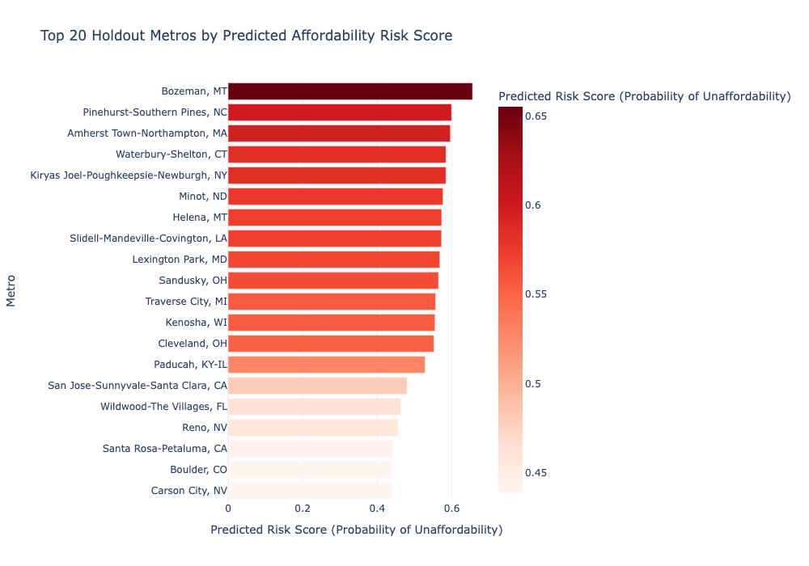

# Where Next? Predicting the Net Unaffordable U.S. City

## Overview

I combined Zillow home values, FHFA house-price data, Census income data, and Census population to identify U.S. metro areas showing signs of housing unaffordability.

- **Team:** Solo project
- **My Role:** I cleaned and joined the data, built the data pipelines allowing for reproducibility, created features, trained XGBoost models, analyzed result with SHAP, and created visualizations.


# Github Links
- [Github Repository](https://github.com/BSmith-cpu/DATA-510-CAPSTONE-)
- [Final Poster (PDF)](https://github.com/BSmith-cpu/DATA-510-CAPSTONE-/blob/main/deliverables/M14-Final%20Poster/BSmith%20Poster%20Final.pdf)
- [Final Writeup (PDF)]()


# Model 1 SHAP plot
{fig-alt="SHAP feature importance chart showing factors associated with housing unaffordability" width="90%"}


# Model 2 At-Risk Metro Plots
{fig-alt="Risk % just means the percentage each metro is following the same trend as the training city" width="90%"}


## The Goal

Housing prices can rise faster than local incomes, making it harder for people to afford homes. This project  uses housing and ecomic data to identify metro areas that show signs of affordability stress. The goal is to help city planners, housing advocates, and lenders identify cities that may need closer review.

## Results

The five-year change is the price-to-income ratio was the strongest sign of current houing unaffordabilitying. House-price growth and longer-term price trends also mattered.

The main model had a 907% accuracy and a 0.943 ROC-AUC when classifying current unaffordability in Austin, Boise, and Tampa

- The mdoel identifies current affordability stress. It does not prove that a city will become unaffordable in the future.

## Reproducibility

The code, data pipeline, notebooks, figures, and project files are available
in the GitHub repository.

```bash
git clone https://github.com/BSmith-cpu/DATA-510-CAPSTONE-.git
cd DATA-510-CAPSTONE-
```

See the repository `README.md`, `notebooks/`, and `src/` folders for the full
analysis workflow. The models use `random_state = 42` for repeatable results.

## Ethics and Data

**Data sources:** Zillow Home Value Index, FHFA House Price Index, U.S. Census American community Survey income, and Census population estimates.

**Data use:** This projce uses public, aggregated metro-level data. It does not include personal or private information. 

**Limitations:** The main model was trained using only Austin, Boise, and Tampa. It results should be used to identify cities for additional review, not as an automatic policy, lending, or investment decision.

